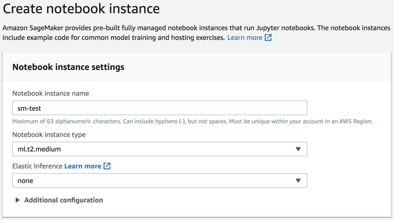
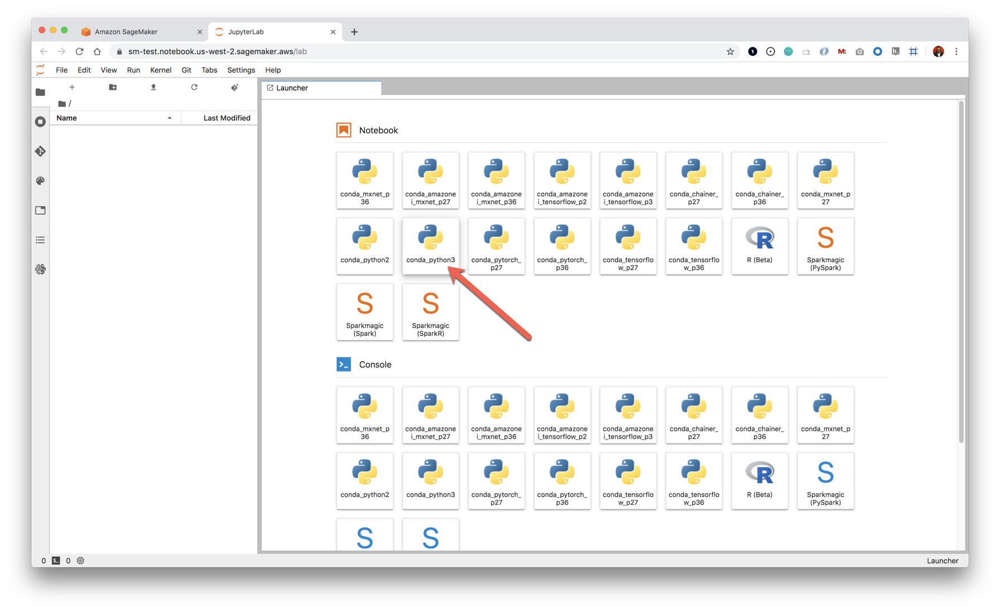

## 13.2 Lesson Plan: Deploying ML Models with SageMaker

### Overview

In today's class, students will be introduced to some Amazon Web Services (AWS) tools and will learn how to leverage some cloud computing services for machine learning using Amazon SageMaker.

### Class Objectives

By the end of class, students will be able to:

* Describe the pros and cons of using cloud services to deploy machine learning models.

* Orchestrate a cloud solution by combining different AWS services.

* Understand how Amazon SageMaker works and how it can be used to deploy machine learning models.

### Instructor Notes

* This lesson introduces new content rapidly. Students may express frustration at learning new cloud technologies. Remind students that while the learning curve may be steep at first, AWS and Cloud experience is highly sought-after and well worth the effort required to become comfortable with it.

* **Important!** Slack out the disclaimer for [AWS Free Tier](../Supplemental/AWS-Free-Tier.pdf) services prior to class. Take some time at the beginning of class to explain that while we are only using free tier services in class, students should review this documentation in order to avoid accidentally incurring charges.

* Note that in the past, AWS content has appeared differently for some instructional teams. It seems that AWS does A/B testing on their UI. If your AWS views _don’t_ match up with the views in the lesson plan, check that you've pulled the latest updates from github or look in the Slack Instructional Team channel for announcements regarding this.

* Check prior to class that all students has a an AWS account and are able to login.

* Today's class should be a fun one. Students will put together many different technologies covered so far and learn how they can interact with cloud services.

* There are a few activities that require setup. Have the class follow along and ask questions as you go.

* Have your TAs keep track of time with the [Time Tracker](TimeTracker.xlsx).

### Slideshow and Time Tracker

* The slides for this lesson can be viewed on Google Drive here: [Lesson 13.2 Slides]().

* To add the slides to the student-facing repository, download the slides as a PDF by navigating to File, selecting "Download as," and then choosing "PDF document." Then, add the PDF file to your class repository along with other necessary files. You can view instructions for this [here](https://docs.google.com/document/d/14MiAunWj30hu-pYLGDz9JOM5XbGjunn1hZ6iyym4w2w/edit).

* **Note:** Editing access is not available for this document. If you wish to modify the slides, create a copy by navigating to File and selecting "Make a copy...".

* The time tracker for this lesson can be found here: [Time Tracker](TimeTracker.xlsx).

---

### 1. Instructor Do: Welcome Class (5 min)

Welcome class to day 2 of Unit 13, this should be a fun one since students will go deeper on using AWS to deploy machine learning models.

Explain students that along this unit, we will use the free tier of AWS, as well as, the trial period for some of the services. Slack out the following resources to be used as reference to understand how the free offer of AWS works.

* [AWS Free Tier Supplemental](../Supplemental/AWS-Free-Tier.pdf)

* [AWS Free Tier Documentation](https://aws.amazon.com/free/?all-free-tier.sort-by=item.additionalFields.SortRank&all-free-tier.sort-order=asc&awsf.Free%20Tier%20Categories=categories%23ai-ml)

Open the [AWS Free Tier Supplemental](../Supplemental/AWS-Free-Tier.md) and briefly explain to students the limits we will have for the services they will learn in this unit.

| Amazon SageMaker (Free Trial)                                                    | Amazon Lex (12 Months Free)       | AWS Lambda (Always Free)                              | Amazon S3 (12 Months Free) |
| -------------------------------------------------------------------------------- | --------------------------------- | ----------------------------------------------------- | -------------------------- |
| `250` hours per month of `t2.medium` notebook usage for the first **two months** | `10,000` text requests per month  | `1,000,000` free requests per month                   | `5` GB of Standard Storage |
| `50` hours per month of `m4.xlarge` for training for the first **two months**    | `5,000` speech requests per month | Up to `3.2` million seconds of compute time per month | `20,000` Get Requests      |
| `125` hours per month of `m4.xlarge` for hosting for the first **two months**    |                                   |                                                       | `2,000` Put Requests       |

Answer any questions before moving on.

### 2. Instructor Do: Creating an Administrator user on IAM (10 min)

In this activity, students will learn how to create an `administrator` user using AWS Identity and Access Management (IAM) service. This will add some extra security when working on AWS.

Explain to students, that a common best practice, is to avoid using the principal or _root_ user to manage their AWS account. This principal user is the one they used to create their AWS account. Instead, a new user for each person that requires administrator access should be created using the AWS Identity and Access Management (IAM) service.

Open the [AWS Managemet Console](https://console.aws.amazon.com) using your _root_ user, and show students how to create a new user on IAM as follows.

* Look for the IAM service on the _Find Services_ search box, type `iam` and click on `IAM` service.

  

* In the left pane menu, choose the _Users_ option and click on the _Add user_ button.

  

* On the _Add user_ page, fill out the details of the new `administrator` user and click on the _Next: Permissions_ button to continue.

  * **User name:** `administrator`
  * **Access type:** Select the _Programmatic access_ and _AWS Management Console access_ boxes.
  * **Console password:** Choose _Custom password_ and type your own password.
  * **Require password reset:** Unselect this box.

  

* On the _Set permissions_ page, choose _Add user to group_ and click on the _Create group_ button.

  

* In the _Create group_ dialog box, type `Administrators` on the _Group name_ textbox.

* Choose _Filter policies_, and then choose _AWS managed - job function_ to filter the table contents.

  

* In the policy list, select the check box for _AdministratorAccess_. Then choose the _Create group_ button.

  

* After creating the group, select the check box for your new group. Choose Refresh if necessary to see the group in the list.

  

* Click on the _Next: Tags_ button to continue.

* On the _Next: Tags_ page, leave the defaults and click on the _Next: Review_ button to continue.

  

* Review the list of group memberships to be added to the new user. When you are ready to proceed, click on the _Create user_ button.

  

* Once the user is created, download the user's credentials by clicking on the _Download .csv_ button. Keep those credentials safe.

  

Enable access to billing data for the IAM admin user as follows:

* On the navigation bar, choose your account name, and then choose My Account.

  

* Scroll down to the _IAM User and Role Access to Billing Information_ section, and click on the _Edit_ option.

  

* Select the check box to _Activate IAM Access_ and choose _Update_.

  

Sign-out from your session, open the `CSV` file with the new `administrator` user credentials and login into the AWS Management Console using the user's URL and password. Tell students, that from now on, they should avoid using their _root user_ and work with this new admin user instead.

Answer any questions before moving on.

---

### 3. Students Do: Creating an Admin user on IAM (10 min)

In this activity, students will create an administrator user to manage their AWS account.

**Instructions:**

* [README.md](Activities/01-Stu_IAM_User/README.md)

---

### 4. Instructor Do: Review Creating an Admin user on IAM (10 min)

This review activity is intended to verify that all students have successfully created their admin user using IAM.

Make sure all students have their AWS account working properly, also, ask TAs to assist students who could have any issue before moving forward, forthcoming activities will use the `administrator` IAM user by default.

Answer any questions before moving on.

---

### 5. Everyone Do: Create an Amazon SageMaker Notebook Instance (20 min)

In this activity, students will learn how to create an instance of Amazon SageMaker, and how to use Jupyter notebooks on the AWS cloud.

Comment to students that you will demo how to create an Amazon SageMaker Notebook Instance, ask them to follow your steps as you move along the demo. Ask TAs to assist students if they get stuck along the process.

Login into your _AWS Management Console_ using your admin user, tell students that the first component that Amazon SageMaker requires is an [Amazon S3](https://aws.amazon.com/s3) bucket to store data to feed machine learning models, or to store prediction results.

To create an Amazon S3 bucket, follow the next steps:

* On the _Find Services_ search box, type `s3` and select the _S3_ service from the list.

  

* On the Amazon S3 console, click on the _Create bucket_ button.

  

* Fill the following details on the _Create button_ window.

  * **Section: Name and region**
    * _Bucket name:_ `sagemaker-<CURRENT-DATE+TIME>` (for example: `sagemaker-20190903-1026`)
    * _Region:_ `US West (Oregon)` (S3 and SageMaker instance regions should be the same)
    * Click: _Next_
    
  * **Section: Configure options**
    * Click: _Next_ (leave defaults)
    
  * **Section: Set permissions**
    * Click: _Next_ (leave defaults)
    
  * **Section: Review**
    * Click: _Create bucket_
    

* Note down (copy/paste/save) the name of bucket for use in the following section.

Comment to students, that the next step is to create a Jupyter notebook instance on Amazon SageMaker. Follow the next steps.

* Navigate to the AWS Management Console homepage, on the _Find Services_ search box type _sagemaker_, and select Amazon SageMaker from the list.

  

* On the Amazon SageMaker console, be sure that `Oregon` is the selected region, on the left pane menu, under _Notebook_ section choose _Notebook instances_.

  

* On the _Notebook instances_ page, click on the _Create notebook instance_ button.

  

* Fill in the following values on the _Create notebook instance_ page:

  * **Section: Notebook instance settings**
    * _Notebook instance name:_ `sm-test`
    * _Notebook instance type:_ `ml.m4.xlarge`
    * _Elastic Inference:_ `none`
    
  * **Section: Permissions and encryption**
    * _IAM role:_ On the dropdown list select the `Create a new role` option.
    
    * Under the _S3 buckets you specify - optional_ section, choose _Specific S3 buckets_ and type the name of the Amazon S3 bucket you created in the past section (e.g. `sagemaker-20190903-1026`), click on _Create role_ to continue.
    
    * _Root access:_ Be sure that the `Enable - Give users root access to the notebook` option is selected. Tell students, that this option is less safe but allows more control over the instance.
    

* Scroll down, and click on the _Create notebook instance_ button to continue. Comment to students, that the creations process takes few minutes to finish.

  

While the notebook instance is being created, comment to students that AWS charges for these and most resources as they are created, event when not in use, this instance is billed for by the second until it's turned off and deleted. Students will learn how to delete these resources later on Today's class.

* Once the notebook instance status is _InService_, it's ready to be used; on the _Actions_ column, click on `Open JupyterLab` to continue.

  

* After few seconds you will see the Jupyter Lab UI, comment to students that this notebook is running on the AWS Cloud.

* On the _Notebook_ section in the JupyterLab _Launcher_, select the `conda_python3` environment to create a new notebook.

  

* On the new notebook, code a hello world in Python in the first cell to test. Be sure all the class has reach this point before moving forward.

  

Comment to students, that it's possible to code a Jupyter notebook from scratch on this Amazon SageMaker's notebook instance, but also, you can open an existing Jupyter notebook. Slack out to students the `monte_carlo.ipynb` starter file, and continue the demo as follows.

* This demo code, runs a Monte Carlo simulation that uses the IEX API, so ask students to have their API key at hand.

* In your Amazon SageMaker notebook instance, in left icon menu, click on the _Upload_ icon (arrow up) and select the `monte_carlo.ipynb` notebook to upload.

  

* Open the `monte_carlo.ipynb` notebook. You'll probably see the message: `Select Kernel` or `Kernel not found`, select `conda_python3` and click on `Select` or `Set Kernel` to continue.

  

* Run all the cells on the notebook, comment to students that now this notebook is going to run on the AWS cloud using Amazon SageMaker.

  

End the demo and answer any questions before moving on.

---

### 6. Students Do: Housing Price Prediction on SageMaker (20 min)

In this activity, students will calculate a linear regression model to predict the price of a house using the Boston Housing dataset and the SageMaker built-in `Linear Learner` algorithm.

**Instructions:**

* [README.md](Activities/03-Stu_Housing_Price/README.md)

**Files**:

* [boston-housing-regression.ipynb](Activities/03-Stu_Housing_Price/Unsolved/boston-housing-regression.ipynb)

---

### 7. Instructor Do: Review Housing Price Prediction on SageMaker (10 min)

**Files**:

* [boston-housing-regression.ipynb](Activities/02-Stu_Housing_Linear_Regression/Solved/boston-housing-regression.ipynb)

Reassure students that it's okay if this was challenging. Amazon SageMaker APIs have a learning curve, as do other AWS resources, along with Machine Learning in general; comment students they will get a lot of practice with AWS Today!

Walk through the solution and highlight the following:

* The date is fetched and analyzed to become familiar with it.

* The data is split into _Test_ and _Train_ datasets and converted into to the [ProtoBuf format](https://developers.google.com/protocol-buffers/) used by Amazon SageMaker's algorithms.

* The prepared and formatted data is uploaded to an Amazon S3 bucket.

* The model is trained using a linear learner algorithm using the data stored in Amazon S3.

* The trained model is deployed on an Amazon SageMaker instance.

* Predictions are performed and the model's performance is scored.

---

### 8. Break (15 min)

---

### 9. Instructor Do: Pros and Cons of Deploying Machine Learning Models with Amazon SageMaker (10 min)

Lead and facilitate a discussion around deploying models in Amazon SageMaker and why a RESTful ML API is useful.

Have students share their opinions with the class and bring up the following points:

**Pros:**

* Data storage capacity: By using an Amazon S3 bucket to store the data, we could have trained a model on multiple terabytes of data, or a lot more space than would otherwise have fit in our personal computer.

* Hardware / GPU: By using different Amazon SageMaker instances to train our model, we can access compute power including GPU capabilities, making powerful hardware available to us as required.

* Cost: Using AWS resources, we only pay for what we use, we'll turn off everything before ending the class and not incur in further charges.

* Availability: By deploying our model to another Amazon SageMaker instance, we have make the prediction functionality available 24/7 through a secured endpoint to an application or to be consumed by others without having to make our computer available.

* RESTful API: As learned in previous units, APIs provide a standard mechanism to access data, our ML API can be consumed through apps and other channels in a simple form while remaining secure and allowing other constraints (for example: authentication, authorization, rate limiting, etc.).

**Cons:**

* Data privacy / security: By uploading data to a third party, you are trusting your data on them. Certain kinds of data are subject to compliance and regulatory constraints.

* Visibility: You won't have oversight on AWS internal handling of your data and infrastructure.

* Availability: Although there are SLAs in place, AWS (and any other cloud providers) can and have suffered outages at times, causing data unavailability.

---

### 10. Instructor Do: Create and Deploy a Machine Learning Model (15 min)

In this activity, students will learn how a machine learning model is created, trained and deployed in Amazon SageMaker.

**Files:**

* [TDB]()

* Open the following Jupyter Notebook (__TBD: or a custom/similar notebook with modified steps__):

* From the main `JupyterLab` view, select `SageMaker Examples`, then scroll to `Introduction to Amazon Algorithms` and find: `linear_learner_mnist.ipynb`

* Run through the notebook.

* TBD.

---

### 11. Student Do: Deploying a Machine Learning Model (25 min)

**Instructions:**

* [README.md](Activities/02-Stu_Practice/README.md)

**Files:**

* [starter-code.js](Activities/02-Stu_Practice/Unsolved/starter-code.js)

---

### 12. Instructor Do: Review Deploying a Machine Learning Model (10 min)

**Files:**

* [solution.py](Activities/01-Ins_Really_Important/Solved/solution.py)

Walk through the solution and highlight the following:

* Something really important

---

### 13. Instructor Do: Delete Notebook Instance (5 mins)

Show students how to delete their SageMaker notebook instance so that no billing charges are incurred for it after class.

* From the SageMaker console, use the left pane menu and visit: Notebook -> [Notebook instances](https://console.aws.amazon.com/sagemaker/home?region=us-east-1#/notebook-instances)

* Select the the Notebook Instance (or follow this process for all) on the left circular dot.

* Once selected, click on the right `Actions` menu and select `Stop`.

* Refresh the page and wait for the instance `Status` to change to `Stopped`.

* Select the instance again, click on `Actions` and select `Delete` then confirm delete.

* At the end of the lesson, the notebook instances list should be empty and state: "There are currently no resources.", otherwise charges will be incurred for any remaining active instances.

* Lastly, go to S3 <https://s3.console.aws.amazon.com> and remove the buckets created for the activity.

- - -

Answer any questions before ending class.

### End Class

- - -

### Copyright

© 2019 Trilogy Education Services
