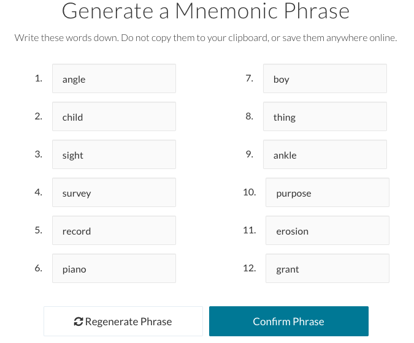
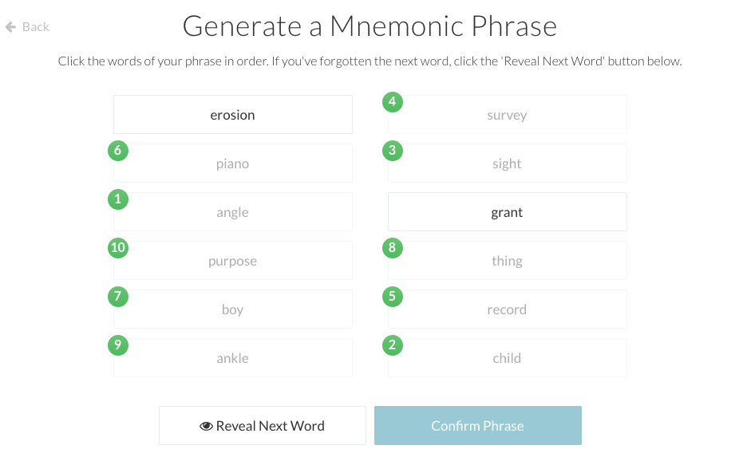
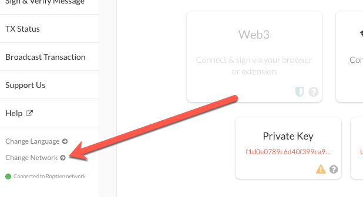
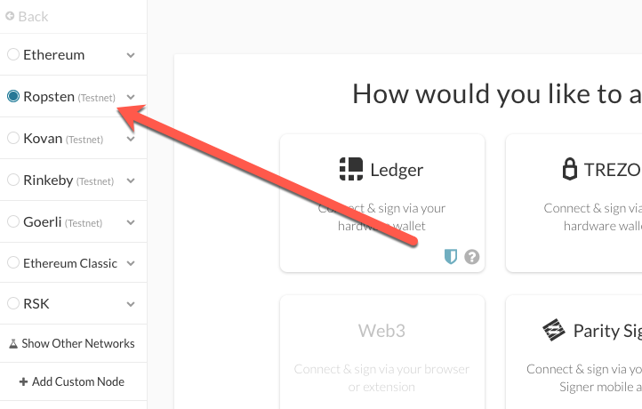
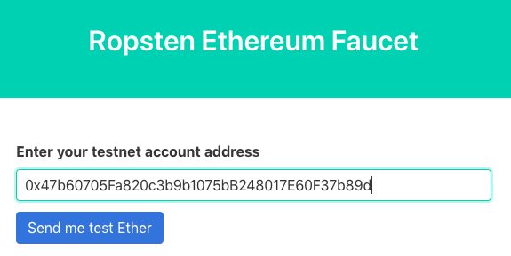

# Using a Wallet

In this activity you will create a crypto wallet with [MyCrypto Desktop App](https://download.mycrypto.com/). If you have not already installed the MyCrypto App, please follow the instructions in [the installation guide](Resources/blockchain-install-guide.md).

Using MyCrypto Desktop App, you will be requesting testnet tokens and sending transactions to your fellow students.

## Instructions

1. Open up the MyCrypto app.

2. Click "Create a new wallet" on the left.

    

3. Choose "Generate a wallet".

4. Use the "Mnemonic Phrase" option. MyCrypto will generate a unique mnemonic phrase for you, write down this phrase **in order** and store it in a safe place. Do not share this phrase with anyone, treat it like your banking password.

    

5. You will need to confirm the phrase by clicking your words in order:

    

Once you are done, you will see the steps you will need to unlock your account in the future.

6. Unlock your wallet by going to "View & Send" and pick "Mnemonic Phrase."

7. Type your mnemonic phrase, with spaces (you can click the eye to view it), then continue to choose an address.

    

8. Once you pick an address to unlock, copy the address on the right hand side.

9.  At the bottom left of the app, click "Change network" and select "Ropsten".

10.  Navigate to this testnet token faucet to request some free test tokens. [https://faucet.ropsten.be/](https://faucet.ropsten.be/)

11.  Paste your wallet address and request the tokens. You can view the transaction status on Etherscan using the link provided.

12.  Once the tokens have arrived at your wallet, send your address to your neighbor and have them send you theirs. You might need to refresh your balance.

13.  Send some transactions to your neighbor(s), checking out all of the different attributes along the way.

Take note of the transactions that have processed on the network for later; you will be using the transaction IDs in the next activity.

---

© 2019 Trilogy Education Services, a 2U, Inc. brand. All Rights Reserved.
