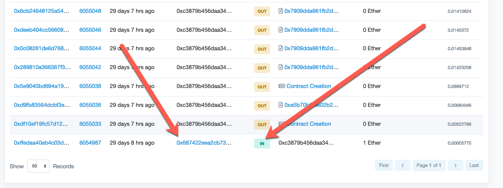

# Visualizing Transactions

Now it's time to visualize the transactions using `Etherscan`..

Get into small groups up to three people, or work with the same groups as before.

## Instructions

1. Navigate to the "Kovan" version of `Etherscan` at [this link](https://kovan.etherscan.io/).

2. Each member of the group, should send a transaction to every member of the group using MyCrypto.

3. Elect one member of the group to send out a transaction hash to the rest of the group.

4. Paste the address into the search on Etherscan:

    

5. Identify the following fields in the transaction:

  * Sender

  * Recipient

  * Amount

  * Block number

  * Fees taken

6. Now, have another student volunteer their address to examine.

7. What was the first transaction this account participated in?

8. Can you tell how old this account is?

9. Explore the first transaction (this should be an input from the token faucet).

    

10. Who is the sender of these test tokens?

11 Explore the sender. This should be an account that the testnet faucet is using to send test tokens from.

12. What is the balance?

13. Can you tell how frequently the test faucet is being tapped from here?

14. What other information can you gleam from these transactions?

---

© 2019 Trilogy Education Services, a 2U, Inc. brand. All Rights Reserved.
