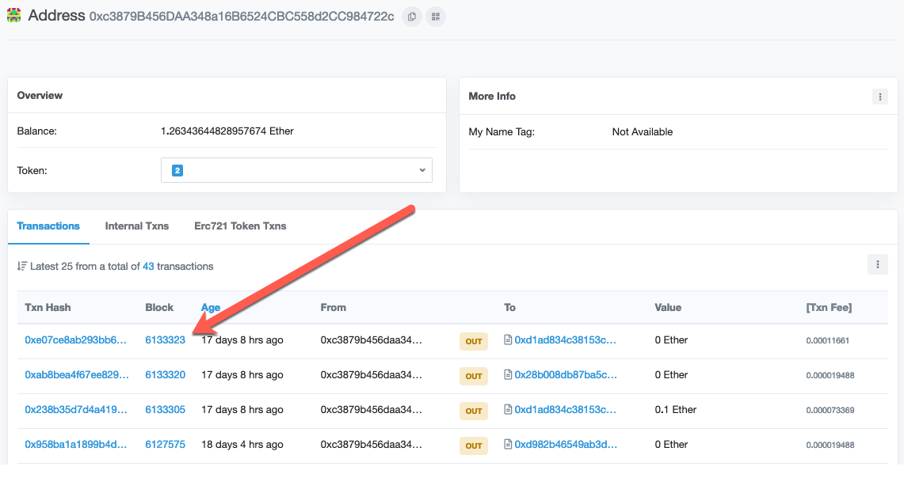
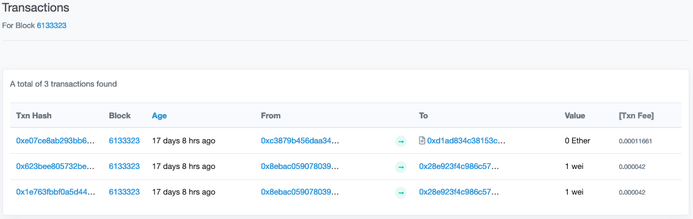

## 18.1 Lesson Plan: Blockchain Building Blocks

### Overview

Today's class will introduce students to blockchain technologies. Students will learn the fundamentals of what the technology is, the types of problems it solves, and how it works.

Most of the people believe that blockchain is only about cryptocurrencies; the goal of this lesson is to break this myth, and get the students thinking about how blockchain technology is used and how it will likely affect their lives as a FinTech entrepreneur, as well as be able to use essential tools like wallets and block explorers to navigate the space and to hold a conversation about the topic.

### Class Objectives

By the end of the class, students be able to:

* Describe why blockchain exists.

* Explain blockchain technology and its use cases to someone that doesn't have any blockchain background

* Describe the 5 Pillars of Open Blockchains.

* Use a blockchain wallet and explain how it works to somebody who doesn't know.

* Visualize transactions via block explorers.

* Students will be able to brainstorm solutions for the those without robust financial institutions.

* Students will be able to navigate the blockchain ecosystem

### Instructor Notes

* Some students may already be involved with cryptocurrencies or other blockchain projects and may have some opinions already about particular blockchain implementations. Due to the niche nature of the field, they may have certain biases already.

* Ethereum has the largest developer community in the blockchain space, learning it has high skill transferability.

* In this unit, students will be introduced to [Solidity](https://solidity.readthedocs.io/), an object-oriented, high-level language for implementing smart contracts for Ethereum.

* Smart Contracts are programs that run on the blockchain, and nothing more. Smart contracts are written in Solidity; next contracts are compiled and created through a transaction on the blockchain. Once the contract is created, it can be used on Ethereum.

* While blockchain inherently has a finance-heavy set of use cases, encourage students to think bigger, since the technology can be used for building secure, globally distributed software.

* There is an activity called "Peoplechain" aimed to emulate the public, censor resistant, and borderless nature of the blockchain; be sure to read through before the class.

### Slideshow and Time Tracker

* The slides for this lesson can be viewed on Google Drive here: [Lesson Slides]().

* To add the slides to the student-facing repository, download the slides as a PDF by navigating to File, selecting "Download as," and then choosing "PDF document." Then, add the PDF file to your class repository along with other necessary files. You can view instructions for this [here](https://docs.google.com/document/d/14MiAunWj30hu-pYLGDz9JOM5XbGjunn1hZ6iyym4w2w/edit).

* **Note:** Editing access is not available for this document. If you wish to modify the slides, create a copy by navigating to File and selecting "Make a copy...".

* The time tracker for this lesson can be found here: [Time Tracker](TimeTracker.xlsx).

---

### 1. Instructor Do: Welcome (5 min)

* **Files:**

  * [Lesson Slides]()

Welcome students to the class by expressing excitement over starting the final lap in this bootcamp marathon -- BLOCKCHAIN -- and that some might say it’s the most exciting lap by far!

Open the lesson slides and highlight the following:

* Blockchain is exciting - and critical for their careers - because blockchain technology powers not just cryptocurrencies but entire decentralized economies and even enterprise networks.

* Blockchain is a buzz-word in the industry, but it’s much more than that -- it’s a new way of thinking about money.

* Traditional financial institutions have been skeptical about blockchain technology, however, JP Morgan Chase, the largest U.S. bank, created [Quorum](https://www.goquorum.com/), an Ethereum-based blockchain, in order to leverage the security that blockchain provides for their own systems (and, probably, because they are afraid of being left in the dust by this new technology!).

* In this unit, students will be building their own blockchain wallets, write smart contracts, and construct a blockchain from scratch.

Some of this may seem intimidating to the students, so express that you are proud of how far the class has already traveled together as a team;
after 17 weeks together, the students can do Python, Pandas, and ML!; and by the end of this block (get it?), they will be able to speak “blockchain” -- but we’re going far beyond the terminology.

Comment to the class that this final stage is huge. That’s going to be challenging, but you know they can do it - after all, they’ve made it this far!

Answer any questions before moving on.

---

### 2. Instructor Do: Blockchain Skill Check (5 min)

Before we dig in, let’s get a sense for where the class might be when it comes to blockchain.

Open the lesson slides and move to the "Have you heard?" section; ask a few questions and have the students give a thumbs up for yes or a thumbs down for no.

* How many of you have heard of blockchain before?

* How many of you have heard of cryptocurrency before?

* How many of you have ever used a blockchain, aka crypto wallet?

* How many of you have ever traded cryptocurrency?

Ask the students to hold out a [fist-to-five](https://k12teacherstaffdevelopment.com/tlb/what-is-fist-to-five-strategy/) (fist for 0, 5 fingers up for 5) to answer how familiar they are with the following topics:

* How familiar are you with blockchain?

* How comfortable do you feel having a conversation about blockchain technology?

* How familiar are you with Ethereum?

Remark on the results.

* “It looks like we have some blockchain experts - awesome!”

Take a mental note of the students with strong familiarity with blockchain, as you will be able to distribute them among groups that have less knowledge about the topic.

Ask the students to hold out again a fist-to-five (fist for 0, 5 fingers up for 5) to answer how familiar they were with the following topics before they started the course.

* How familiar were you with Python?

* How comfortable were you having a conversation about machine learning?

* How familiar were you with data science?

Remind the students that just like they learned how to master Python and ML, they will surprise themselves with how much they learn over the course of the coming weeks.

It may seem like a foreign language at times, but they’ve already learned a new language as part of this course, and you and the TAs will be there to guide them.

Tell the students it’s time to dig into blockchain: first things first, let’s start with a definition.

Ask the students if anyone has a definition of blockchain that they would like to share with the class. Thank the students for sharing.

Show the definition of blockchain on the slide, and ask the students to read it to themselves.

Ask them if they have questions. Then, break down the definition.

* A blockchain is a distributed "immutable" database that is not controlled by a single, central authority.

* The database is synchronized across the network, with special rules in place to incentivize good actors and disincentivize bad actors.

* It is immutable, which means you can only add to the database: you cannot change the history.

* This provides a powerful means of creating a trusted "source of truth" in a trustless environment.

Answer any questions before moving on.

---

### 3. Instructor Do: The Importance of Blockchain (10 min)

For this activity, the instructor will lead a formal discussion regarding what blockchain technology is and why it’s important.

First, navigate to the slides and begin with the "Bank CEO" example:

Ask the students the following questions, giving them an opportunity to answer, then confirm each of the listed answers:

* "Why would a banker want to use a blockchain?"

  **Answer**: Using a blockchain for inter-bank communication is faster, more secure, and cheaper than the systems in place now, Swift and ACH.

* Why would an individual in an underbanked, developing, or authoritarian country want to use a blockchain?

  **Answer**: Transactions cannot be censored.

  **Answer**: You only need a mobile device and internet connection, which is a common commodity even in developing countries.

  **Answer**: Some blockchains can be used as a hedge against hyperinflation of their native currency.

* Why would an individual in the US want to use a blockchain?

  **Answer**: Removes intermediaries like PayPal, Venmo, Cashapp, etc, and allows for peer to peer payments, thus lower fees.

  **Answer**: Custody over your funds, versus allowing a bank to have custody.

  **Answer**: Cheaper than domestic wire transfers

  **Answer**: Brings financial services typically available to the upper class to everyone.

* Why would anyone want to use blockchain?

  **Answer**: Fast, global transactions that are not managed by a single authority

  **Answer**: Secure, modern infrastructure for the next generation of the internet. This is also known as Web 3.0.

Answer any questions before moving on.

---

### 4. Students Do: Use Case Study (10 min)

Students will complete a thought experiment in which the students will get together in small groups and examine an example use case application
for different cryptocurrency and blockchain projects.

The goal is to have the students write down the features they glean from the different use cases.

The features listed by students, will be compared against the 5 Pillars of Open blockchains in a following lecture.

Circulate through the room while students are completing the activity. Look to identify students who are actively engaging peers and digging deeper. Keep these students in mind for later as they may be helpful to distribute among groups.

If students are actively engaged with each other and the research process, they are succeeding at this exercise.

The only way to not excel at this exercise is to not participate in the research.

**Instructions:**

* [README.md](Activities/04-Stu_Use_Case_Study/README.md)

---

### 5. Instructor Do: Use Case Study Review (5 min)

Discuss with the class which features they noticed.

Have groups share a few items on the lists of features they curated.

Some common features may be:

* Transparency

* Privacy (in the case of Monero)

* Smart contracts

* Neutrality

* Hedge against hyperinflated currencies

* Bridge of trust between parties that might not trust each other

* Cross-border nature

* Pseudonymous system (addresses are your alias, not necessarily attached to identity)

Answer any questions before moving on.

---

### 6. Instructor Do: The 5 Pillars of Open Blockchains (10 min)

For this activity, the instructor will lead a formal lecture regarding what the 5 pillars of open blockchains are and why they are relevant.

See the [blockchain support document](../Instructor_Support/Blockchain.md) for a background video on this topic.

Start this activity by commenting to the students the following:

* As we talk through each pillar, keep in mind what you uncovered during the previous exercise. What feature would you put in each category?

* These pillars are the fundamental features that blockchains were created to provide. Learning these will help you understand how some blockchains sacrifice these features for speed or marketing purposes instead of innovating on the underlying algorithms.

* The chains that innovate on these features are the most universal in terms of feature sets, and can be easily adapted to enterprise.

Then, transition through the slides and begin talking about each topic.

Begin by prefacing that each of these pillars ties into each other to build an open blockchain network.

#### Pillar 1: Open


* Openness in this context refers to access:

  * Anyone can access the source code and create a project from it, therefore developer access is high.

  * Anyone can access the chain and participate in the ecosystem.

  * Anyone can access the services the blockchain offers.

* Openness means that the system is designed to incentivize users to keep it open. The internet is an example of this, it is built on open protocols that anyone can learn and contribute to.

#### Pillar 2: Borderless


* Explain to the students that borderless means exactly that, a network without geographical or political borders.

* To be borderless, the network needs to be decentralized. This means that the control of the network is not held by any central party.

* Since the blockchain is synchronized onto every device that helps maintain it (called nodes), it lives everywhere.

Ask the students: "Are you moving money across a border when you bring a credit card across customs?"

  **Answer**: No

Ask: "In that case, are you moving money across a border when you load cryptocurrency onto your phone and travel internationally?"

  **Answer**: Nope, you only have to register cash over 10k

Elaborate and bring out this analogy:

* Much like the money is not on the card itself, a crypto wallet does not hold the crypto itself, just the access.

* The blockchain is already synchronized to a device in the country you are traveling to, so accessing it is the same as if you were to swipe a Visa card internationally, only without Visa getting involved.

* You can also use a satellite connection to connect to blockchain networks and broadcast transactions, therefore it is truly global.

#### Pillar 3: Neutral


* Explain how neutral means that the protocol does not discriminate against any user.

* In fact, users don't even need to be human. The blockchain does not care if you are a human or a washing machine.

* The blockchain is agnostic to the users, regardless of political or social status, or geographic location.

* A wealthy banker or government leader use the protocol in the exact same way anyone else would.

* Open blockchain networks are also governed in a neutral fashion, with many using the blockchain itself for voting on the next network upgrades.

#### Pillar 4: Censor Resistant


* Blockchains that are properly decentralized are highly resistant to censorship and authoritarian control.

* This means that people suffering in nations that have high censorship can still find a way to use these systems to reach out and to bypass the oppression.

* Blockchain is being used currently around the world to avoid censorship or hyperinflation in many countries.

* It has been said that blockchain and crypto can be seen as an insurance policy against a dystopian future.

* Money is often compared to a form of speech. These are systems where this form of expression cannot be censored.

#### Pillar 5: Public


* Explain that this means that open blockchains are separate from the state. Public blockchain networks are suited for public affairs.

* Military or government work, or certain logistic implementations will likely be suited to a private network due to the confidential nature.

* This is at least until zero-knowledge proof technology that allows for total privacy on a public blockchain is further developed to scale.

* This separation of state and money is a first in history, and is similar to the separation of church and state to allow for religious freedom, only this allows for monetary freedom.

* Explain how these systems are built by the people, for the people, and are governed by the people.

Ask the students to compare the 5 Pillars to the features that they had written down during their use case analysis and to compare and contrast what they came up with to what they just learned.

Answer any questions before moving on.

---

### 7. Student Do: Peoplechain (15 min)

For this activity, students will emulate the public, censor resistant, and borderless nature of the blockchain by creating a distributed ledger like system breaking up into groups and using themselves as network participants.

#### Activity Logistics

You will need to group students into at least three groups:

* Group 1 - Money senders. This group will create and send transactions.

* Group 2 - Record Keepers in the US. This group will be a geographical region of "nodes" in the US.

* Group 3 - Record Keepers outside the US. This group will be a second geographical region of "nodes" in a different country than the US.

To speed up this activity, organize the three groups before class and let students know which group they belong to by creating some slides or a document to show in the projector during the activity.

You should create at least two slack channels for this activity, name the channels as follows:

* RecordKeepersUS

* RecordKeepersChina (China is just an example, feel free to choose another country)

Add students to their corresponding slack channel before class.

Run a couple of test transactions after starting the activity. Time the students and allow them to transact for at least 5 minutes.

Have TAs circulate to provide assistance to students facing challenges or to clarify the role of each student.

**Instructions:**

* [README.md](Activities/07-Stu_Peoplechain/README.md)

---

### 8. Instructor Do: Peoplechain Review (10 min)

Ask every group to make a list of all the transactions they have a record of in order of highest dollar amount to lowest dollar amount.

Ask each group to slack their list to you.

Show the two different lists on the board. They should be the same, if they aren’t, ask: why aren’t these the same?

Did someone miss a transaction? In this case, keep in mind this is why we have computers do it for us.

Did someone lie about a transaction? In this case, it’s easy to tell because we have so many records of the transaction.

Ask the students a few questions about the activity:

* If one person lied about a transaction, would it be easy to tell?

  **Answer**: Sure, you could double check with another one of the many records of the transaction.

  **Answer**: In reality, there are cryptographic features that will also prevent this.

* What would you do if you discovered a record keeper was lying, or not responding?

  **Answer** Take note and stop communicating with them.

  **Answer** You might even tell others that they lied.

* What are the ways this system is making lying harder to do?

  **Answer** Since the ledger is everywhere, and transactions are broadcasted to everyone, it is difficult to lie.

* Theoretically, all the students in each country could be connected to each other.

* In our example, we just had one “internet connection” between the Slackers for each country.

Ask the students to ponder the following (no answer required):

* So, given the possibility of all these connections, what if one entire region had a different list of transactions?

  **Answer** You would have a consensus problem -- we’ll discuss how to manage this with consensus algorithms in a later lesson.

Answer any questions before moving on.

---

### 9. Student Do: Basic Terminology (10 min)

For this activity, students will Google common terminology used in blockchain development.

Have the TAs circulate through the class and clarify definitions for students that are confused.

**Instructions:**

* [README.md](Activities/09-Stu_Basic_Terminology/README.md)

### 10. Instructor Do: Basic Terminology Review (10 min)

Students will learn basic, common terminology that will enable them to navigate the blockchain space.

* **Files:**

  * [Lesson Slides]()

Navigate to the slides and define common terms:

#### Hash


* Explain that a "hash" is a unique fingerprint of a piece of data.

* A hash function is one-way, which means that you cannot reverse a hash much like you can't reverse mixing paint.

* There are several popular hashing algorithms, SHA256 being one of the most popular.

* However, it is easy to run the hash function over the same data again to verify the result is the same.

* If you were to change a single bit of the input, you would get a completely different hash. This allows for something called "data integrity" which is a very important part of internet and data security as well as blockchain technology.

#### Digital Signature


* Digital signatures are used to mathematically prove ownership or authenticity of data.

* Once a file or message is signed, you can verify it was signed by a specific individual.

* If the signed message is modified, the signature will be invalidated.

* This means that if you were to sign a document, and the document was later modified, the signature would invalidate. You could then easily prove that the document was modified. This is not just used for documents, but secure internet communication as well.

Ask the students "If a signed message is modified, what happens?"

* **Answer** The message will be invalidated and you would know the message was modified

#### Crypto Wallet


* A digital wallet is simply a set of "keys" to your funds that are on the blockchain.

* This means that with a wallet, you can create and send transactions, as well as view your balance.

* You can also sign messages with your digital wallet to prove ownership or authenticity of something.

* A digital wallet is much like the debit cards in your own wallet, you use them to access funds in your account. Only in this case, the card is now a key, and the bank is now the blockchain.

At this point, students should be curious about what a transaction is in the context of blockchain, continue with the slides and highlight the following:


* A transaction is simply a signed message that authorizes a movement of funds between two parties.

* It is essentially "I sign off on the movement of X amount of value from account A to account B" -- now that it is signed off, nobody can modify it.

#### Blockchain Node


* A full node keeps a copy of the blockchain. It verifies every transactions signatures and throws out any that do not validate.

* If you wanted to send a transaction, you would send it to a node to keep track of. Nodes broadcast the transaction to their neighbors, until a miner comes along and finalizes the transactions.

* Nodes are enforcing **all** of the rules of the blockchain, thus they are a very important part of the security of the network.

#### Miner or Block Producer


* A miner/block producer is a special type of node that is working to solve computations in order to finalize transactions.

* Miners take the pending transactions from the nodes they are connected to and put them into a block.

* Each miner races against each other to perform this process first, and the winner is rewarded by the network for its work. Then this race happens again and again for each new block in the chain.

Reassure the students that we will dive deeper into the mechanisms in which nodes and miners communicate with each other, as well as the full life cycle of a transaction from creation to being stored in a block.

Answer any questions before moving on.

---

### 11. BREAK (15 min)

---

### 12. Student Do: Using a Wallet (10 min)

For this activity, students will be testing a cryptocurrency wallet.

Have the TAs circulate through the class and ensure that students are able to send and receive transactions.

**Instructions:**

* [README.md](Activities/10-Stu_Using_Wallet/README.md)

---

### 13. Instructor Do: Using a Wallet Review (5 min)

Ask the students: "What types of things stood out to you?"

  **Answer**: You can pick your own fees

  **Answer**: You can view the status of the transactions live

Let the students know that there are many types of wallets. We just used a desktop wallet,
but the students will be building one next unit.

Ask if any students noticed the "data" field, and what it might be.

* Explain that this field is where contract calls or arbitrary strings can be stored within the transaction.

### 14. Instructor Do: Block Explorers Demo (10 minutes)

The goal of this demo is to show the students how block explorers can be used to visualize transactions on the blockchain.

Open [this link](https://ropsten.etherscan.io/address/0xc3879b456daa348a16b6524cbc558d2cc984722c) to the Ropsten Etherscan block explorer.

This has an address pre-populated, but it is recommended to use an account that you own and have made the transactions personally since you
will be more familiar with them.

* Point out the balance field. Reflect that this is part of the public nature of blockchains, and some blockchains have this field hidden,
  like Zcash and Monero.


* Scroll through the list of transactions that this account has made. Ask the students if any of these fields stand out in particular, and why?

* Point out the "Transaction Hash" column on the very left.

* Click on a transaction hash for any of the transactions.


* Ask the students what they think a transaction hash might be, and what it might be used for.

  **Answer**: The transaction hash is used as the unique ID of the transaction to find it later.

* Go back to the initial address page, then click on the "block number" section of a transaction



* Point out the fields "Mined By" and "Block Reward" and explain that this is the address of the miner that successfully created this block
  and received that amount of Ether as reward.


* Click on the "Transactions" button to view which transactions were mined in that block.


* Explain that these are the transactions that were mined in this particular block:



Have a student volunteer to send out the transaction hash of a transcation they made to a fellow student.

Walk through the student's recent transactions and point out the "from", "to", and "amount" fields and verify this with the students that these transactions ocurred between.

Ask the students to point out any fields that may confuse them or that they are curious about.
If they point out the following terms, reassure them that they will be explained in greater detail later:

* Difficulty

* Gas

* Gas Limit

* Nonce

### 15. Student Do: Visualizing Transactions (10 min)

For this activity, students will visualize transactions using the same technique used in the demo.

Students will get into small groups and will explore the blockchain using Etherscan together.

Have TAs circulate to provide assistance to students facing challenges or to clarify the role of each student.

**Instructions:**

* [README.md](Activities/14-Stu_Visualizing_Transactions/README.md)

### 16. Instructor Do: Visualizing Transactions Review (5 min)

Review the groups and ensure that students can navigate and visualize transactions.

Recap by asking the students to answer these questions:

* "What is a transaction hash?"

* "What type of information is available to you on a public blockchain's block explorer?"

  **Answer** Practically everything, balances, transaction history, data stored on chain, etc.

* "Is this a fully anonymous blockchain?"

  **Answer** No, the current version of the public Ethereum network is pseudonymous, not fully anonymous yet.

Explain to the class that while the current version of Ethereum is pseudonymous, future updates will bring a technology
called "Zero Knowledge Proofs" that will enable completely private transactions on a public network.
This means that the balances and transaction history between accounts will be encrypted in a way that allows
for verification without exposing potentially sensitive information.

This allows for private, enterprise applications to run on open blockchains!

This means that in the future, transactions will be private, and you will only be able to view transactions that you are a part of.
There are currently public blockchains like Zcash that implement this now by default, so be on the look out for zero knowledge protocols
in future blockchain upgrades.

### 17. Instructor Do: Intro to Ethereum (10 min)

Walk through the slides and highlight the following:

Ask the students:

* What would it be like to be able to code with money, like this?

  ```python
  amount = $10 dollars
  recipient = "JaneDoe123"
  wallet.send_transaction(amount, recipient)
  ```

  That's what Ethereum brings to the table, just replace a couple fields:

  ```python
  amount = 0.05 Ether
  recipient = "0xc3879B456DAA348a16B6524CBC558d2CC984722c"
  wallet.send_transaction(amount, recipient)
  ```

  Note: this is pseudocode, but should get the point across.

* Ethereum secures over $20 billion in assets without a central authority. It powers a huge ecosystem of decentralized applications
  and financial ecosystems.

* First generation blockchains were much like the days of carrying a cell phone, iPod, and calculator with you. Each solved a specific problem.
  Ethereum brought to blockchains what the iPhone brought to personal computing, a general purpose platform where apps take the place of separate devices.
  Now, you can build fully fledged applications, called "Smart Contracts" on top of the blockchain with Ethereum.

* You can think of Ethereum like the inverse of AWS Lambda. With Lambda, you upload your code to Amazon and pay per use.
  Amazon in this case is the central party, they control the computing. Whereas in Ethereum, every person who helps run Ethereum
  becomes part of the "global computer" and you pay the network itself to run your code instead of a single party.

* Ask the students: "What are some benefits you can think of to having compute power distributed in such a way?"

  **Answer** No bottlenecks in the system, since the world helps run the code

  **Answer** Highly reliable systems that will run regardless of if some servers go down

If students are unclear as to how this works, reassure them that they will be learning the inner workings when they begin Smart Contracts in Unit 20.
The biggest point to get across is that everyone shares computing power in order to create a platform that anyone can upload and run code on top of.

Now, transition to talk about the types of financial services that you can build with Ethereum:

* Payments - Peer to Peer, Business to Business, Business to Customer, Machine to Machine

* Remittances – Movement of funds across borders into a bank account.

* Loans – Using crypto-currency as collateral for loans to reduce costs of transactions.

* Deposit taking – Storing crypto in wallets to use as interest earning assets.

* Notary services – Blockchain based notary services that authenticates documents.

* Brokerage services – Trading tokens and other digital assets on the Blockchain.

* Foreign exchange – Using crypto as a bridge between fiat/government currencies to reduce the cost of foreign currency fees.

* Decentralized crypto exchange - Using the blockchain as a backend to support a crypto-trading exchange.

* Tokenizing assets - Representing things from the US Dollar, Gold, Securities, to unique video game assets a on the blockchain.

### 18. Student Do: Use Case Brainstorm (10 min)

Now that the students have learned about the features of Ethereum and how it acts as a decentralized world computer,
it is a good time to brainstorm different use cases given these features.

Students will get into groups and come up with different decentralized application ideas, as well as discuss dapps
they may be familiar with.

Have TAs circulate throughout the class, facilitating discussion and ensuring students are not lost.

**Instructions:**

* [README.md](Activities/15-Stu_Use_Case_Brainstorm/README.md)

### 19. Instructor Do: Use Case Review (10 min)

Ask different groups what their most interesting use case was and have them describe them to the class.

Facilitate the discussion toward the benefits of decentralizing certain applications.

* What are the main benefits of decentralizing your application?

  **Answer** The application can only go down if the entire Ethereum network goes down.

  **Answer** The application can run without a central server.

  **Answer** The application could potentially live forever (as long as Ethereum exists).

  **Answer** The application is pay-per-use, much like a decentralized AWS Lambda.

* If the students chose a game-based use case, ask what type of assets they have represented?

* Is there a limit to what you can build with Ethereum's Turing complete smart contracts?

  **Answer** No, in theory, you could build any application just as you would with any other general purpose programming language.

Reinforce the idea that Ethereum's smart contracts are just programs that run on a distributed, decentralized computer.
Anyone can upload and pay to run code in a secure sandboxed compute environment, allowing for a more secure, immutable web,
and for building powerful financial applications.

### 20. Instructor Do: Recap (5 min)

Students have learned tons of new information today. Facilitate a discussion around the different ideas that were spoken about during
the class, and what questions students may be asking the most.

* What types of blockchain applications excite you the most?

* What types of financial services can blockchains improve?

  **Answer** Practically any that currently requires unnecessary middlemen

* How does blockchain technology improve the lives of people around the world?

  **Answer** It provides robust financial platforms that don't always exist, or are not trustworthy.

  **Answer** It supports borderless, neutral, and censor resistant finance that cannot be oppressed easily.
